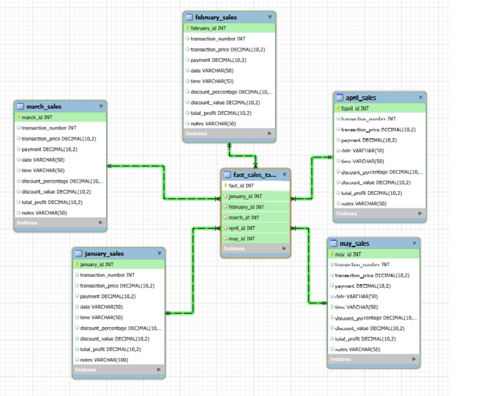

# 💊 Pharmacy Sales Data Warehouse

## 📋 Project Overview
A structured data warehouse solution for pharmacy sales analytics. This project transforms 5 months of raw transactional data into a normalized, query-optimized MySQL database using a **Star Schema** design. The focus is on clean data architecture, referential integrity, and efficient analytical querying.

## 🎯 Objectives
- ✅ Clean and validate raw CSV sales data using Excel
- ✅ Design and implement a Star Schema for analytical reporting
- ✅ Create relational monthly tables linked by a central fact table
- ✅ Enable fast month-over-month sales, discount, and profit analysis
- ✅ Demonstrate end-to-end data engineering workflow

## ️ Database Architecture

### Schema Components
| Table Type | Table Name | Description |
|------------|------------|-------------|
| **Fact Table** | `fact_sales_table` | Central linking table with foreign keys to all monthly tables |
| **Dimension Tables** | `january_sales` to `may_sales` | Monthly transaction records with pricing, discounts, and profit metrics |

## 🛠️ Technology Stack
- **Database:** MySQL 8.0+
- **Data Cleaning:** Microsoft Excel (Formulas, Remove Duplicates, Data Validation)
- **Query Language:** SQL (DDL, DML, JOINs, CTEs)
- **Design Pattern:** Star Schema (Dimensional Modeling)
- **Version Control:** Git & GitHub

##  Project Structure
pharmacy-sales-data-warehouse/
├── README.md # Project documentation
├── sql_scripts/ # All table creation & insertion scripts
│ ├── 01_create_january_sales.sql
│ ├── 02_create_february_sales.sql
│ ├── 03_create_march_sales.sql
│ ├── 04_create_april_sales.sql
│ ├── 05_create_may_sales.sql
│ ├── 06_create_fact_table.sql
│ └── 07_insert_data.sql
── etl_scripts/ # Data cleaning documentation
│ └── data_cleaning_process.md
├── images/ # Architecture diagrams
│ └── schema_diagram.png
🧹 Data Cleaning Process
Raw CSV files were cleaned using Microsoft Excel before database import:
✅ Filled missing transaction numbers and numerical fields
✅ Standardized dates to YYYY-MM-DD and time to HH:MM:SS
✅ Validated discount calculations: Discount = Price × (Percentage / 100)
✅ Removed duplicate transactions using transaction_number as key
✅ Ensured consistent data types and decimal precision
Full cleaning steps documented in: etl_scripts/data_cleaning_process.md
💡 Business Value
This architecture enables:
📊 Fast Aggregations: Star schema optimizes SUM(), AVG(), and GROUP BY operations
📈 Trend Analysis: Easy month-over-month revenue and profit tracking
🛡️ Data Integrity: Foreign keys prevent orphaned records
🔍 Scalability: New monthly tables can be added without restructuring
💼 Reporting Ready: Direct compatibility with Power BI, Tableau, or Excel pivot tables
🎓 Skills Demonstrated
Dimensional Data Modeling (Star Schema)
SQL DDL/DML & Foreign Key Relationships
Data Quality Management & ETL Documentation
Database Normalization vs Denormalization Trade-offs
Analytical Query Optimization
👤 Author
[Hossam Hassan Ragab ]
[hossamhassann244@gmail.com]